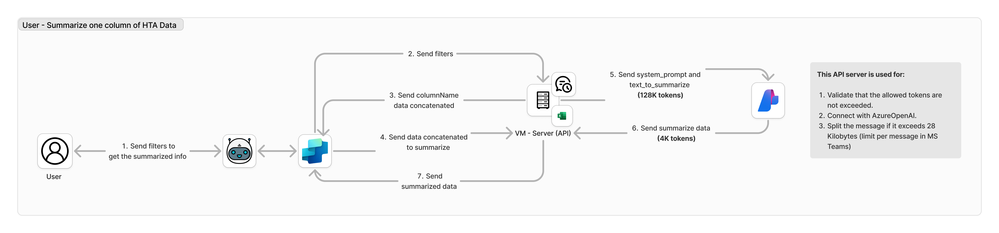
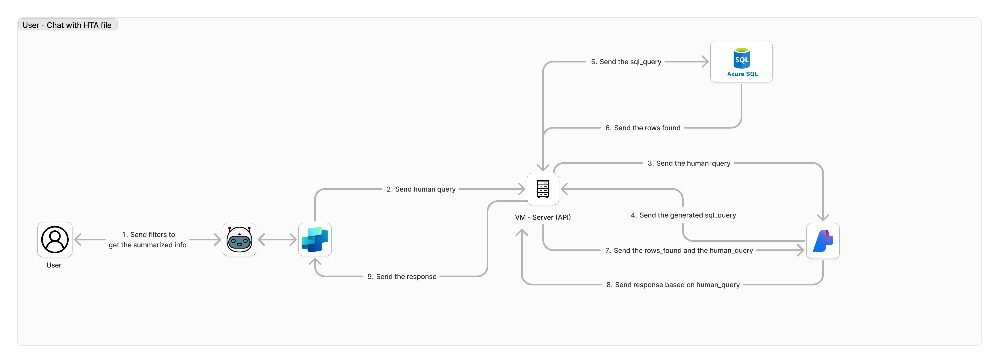

# CENEXAL-TEAM

Private project

## Prerequisites

Before running this application, make sure you have the following .env variables:
```
API_KEY=
AZURE_ENDPOINT=
AZURE_OPENAI_KEY=
AZURE_DEPLOYMENT=
AZURE_OPENAI_API_VERSION=
AZURE_OPENAI_URL=
AZURE_SQL_USER=
AZURE_SQL_PASS=
AZURE_SQL_SERVER=
AZURE_SQL_DATABASE=
```

## Installation

1. Clone this repository:
```
git clone https://github.com/e-lua/cenexal-team.git
cd cenexal-team
```

2. Build the image:
```
docker-compose --env-file .env build
```

3. Run the container:
```
docker-compose --env-file .env up -d
```

## Docs

The API is built on FastAPI, you can view the integrated documentation through:
```
http://localhost:1440/docs
```

## Features

The features available to interact with in the copilot are:

1. Summarize one column of HTA Data
2. Chat with HTA file

## Feature 1: Summarize one column of HTA Data



1. The User sends the filters they selected via the datacard and the column they want the summary for in MSTeams.
2. The Copilot sends the filters and the column to the Server.
3. The Server responds with the column with the concatenated data of the found rows.
4. The Copilot sends the concatenated data to the Server to be summarized.
5. The Server sends the data to be summarized to the gpt-4o model configured in Azure OpenAI Studio.
6. The model responds with the summary.
7. The Server and Copilot send the summary to the User.

## Feature 2: Chat with HTA file



1. The User sends the filters they selected and the column they want the summary for via the datacard to MSTeams.
2. The Copilot sends the human_query to the Server
3. The server sent the human_query to Azure OpenAI to convert the text into a SQL query.
4. Azure OpenAI responds with the SQL query.
5. The server executes the SQL query on Azure SQL Server.
6. Azure SQL Server responds with the rows and columns requested in the SQL query to the server.
7. The server sent the rows and columns found along with the human_query to Azure OpenAI.
8. Azure OpenAI builds the response based on what the user has requested in the human_query, for example, a summary.
9. The Server sends the response to the User.